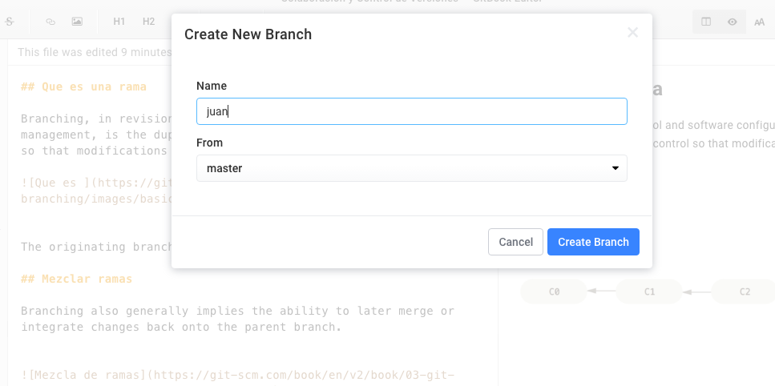
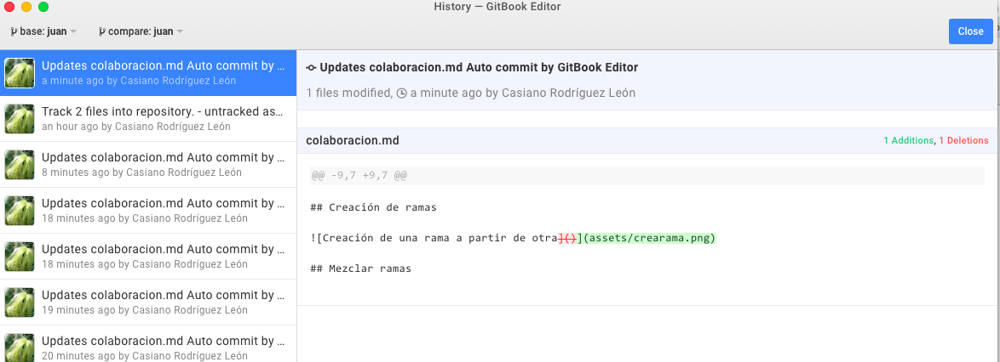
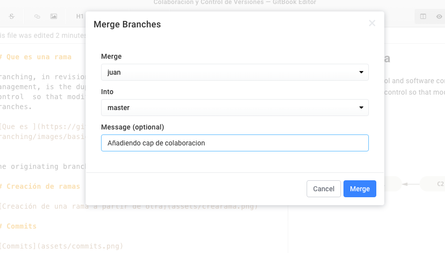
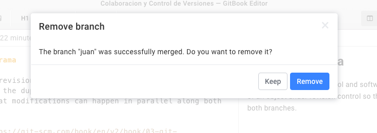

## Que es una rama

Branching, in revision control and software configuration management, is the duplication of an object under revision control  so that modifications can happen in parallel along both branches.

The originating branch is sometimes called the upstream branch.

## Creación de ramas

## Commits

## Mezclar ramas

Branching also generally implies the ability to later merge or integrate changes back onto the parent branch. 

## Desktop Editor

En la versión desktop del editor tenemos varias formas de sincronizar.

### Sincronizando entre la nube y nuestro ordenador

* **Revision History**: Muestra el histórico de versiones guardadas
  - 
* **Create Branch**: Creamos una rama a partir de otra
* **Remove Branch**: Eliminar la rama
* **Merge Branches**: Fusionar los cambios en una rama 
en otra rama que recibe los cambios
* **Sync**: Asumir los cambios externos al GitBook Desktop editor en los directorios del libro 
* **Push**: Mandar los cambios guardados a la nube
* **Pull**: Traer cambios de la nube a tu ordenador

## GitHub
 
### GitHub Issues / Incidencias {#issues}
  
Issues are a great way to keep track of tasks, enhancements, and bugs for your projects. 
They’re kind of like email—except they can be shared and discussed with the rest of your team. 

* [Mastering Issues](https://guides.github.com/features/issues/)

### Ejemplo de Colaboración usando GitHub y GitBook

Este es un ejemplo de colaboración desarrollado por los alumnos de la asignatura [Sistemas y Tecnologías Web](https://campusvirtual.ull.es/1617/course/view.php?id=1175): 

* [Libro con las Presentaciones de los Alumnos de SYTW](https://ull-esit-sytw-1617.github.io/presentaciones-todos/)
  * [Repositorio GitHub con los contenidos del Libro](https://github.com/ULL-ESIT-SYTW-1617/presentaciones-todos)
  * [Issues/Incidencias](https://github.com/ULL-ESIT-SYTW-1617/presentaciones-todos/issues?q=is%3Aissue+is%3Aclosed) del proyecto
  * [Ejemplo de Proyecto asociado al libro](https://github.com/ULL-ESIT-SYTW-1617/presentaciones-todos/projects/1)
  * [Contributors/Personas](https://github.com/ULL-ESIT-SYTW-1617/presentaciones-todos/graphs/contributors)
  * [Actividad de  commits/Guardados](https://github.com/ULL-ESIT-SYTW-1617/presentaciones-todos/graphs/commit-activity)
  * [Network](https://github.com/ULL-ESIT-SYTW-1617/presentaciones-todos/network)

## Como Instalar GitBook en una Máquina Windows

* Deberá instalar [Git for Windows](https://git-scm.com/download/win)
* Y seguir estas instrucciones: [GitBook Setup](https://toolchain.gitbook.com/setup.html)

## GitHub Desktop: Instalación y Guías

* Puede instalar una interfaz gráfica para GitHub denominada: [GitHub Desktop](https://desktop.github.com/)
* [Guías para aprender a usar GitHub Desktop](https://help.github.com/desktop/guides/)

## Desplegando un libro en GitHub usando git y GitHub
* https://youtu.be/Lcz69R1FDRA

