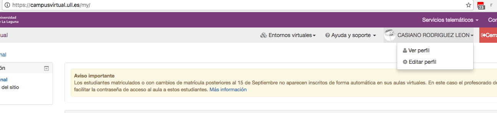
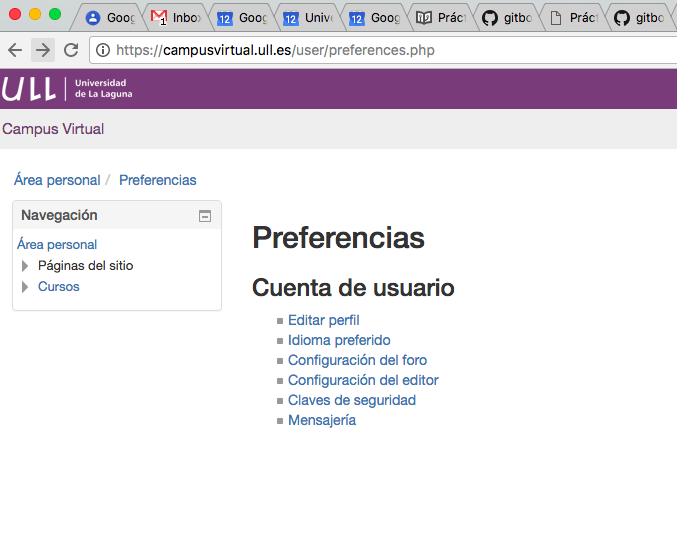
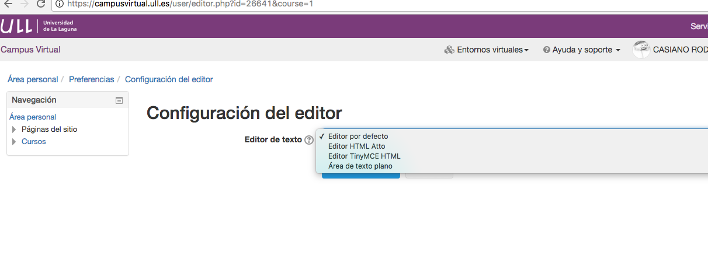
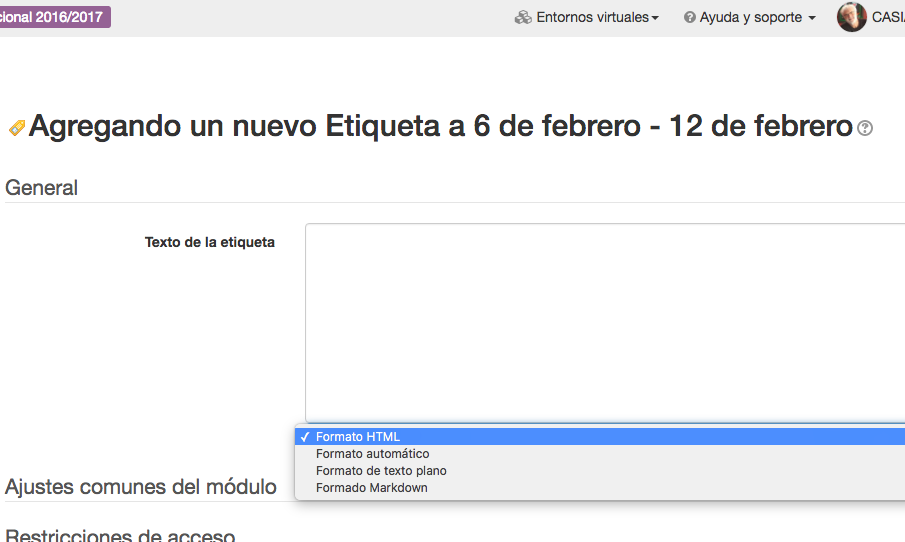

## Moodle y MarkDown

MarkDown puede usarse como formato de edición en Moodle.

¡Chazam!

-----

Configure su Editor en Moodle. Primero edite su perfil:

1. 
2. 
3. 

Ahora le sale la opción MarkDown cada vez que creamos un nuevo recurso o tarea:

3. 
